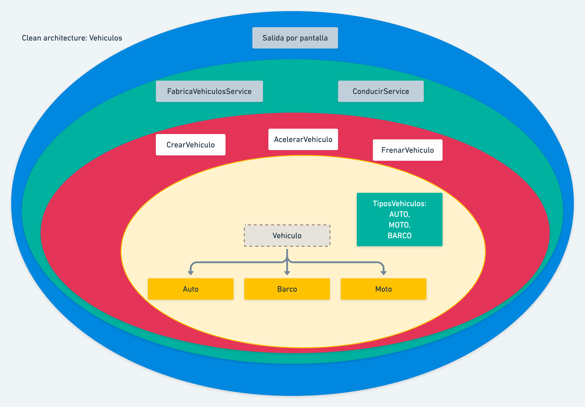

# Inyección de dependencias con Guice + clean architecture

## Requerimientos:
* Se deben poder crear 3 tipos de vehículos: Autos, Motos y Barcos.
  
* Se puede crear una instancia de una fábrica de vehículos Honda.
  
* Los vehículos deben poder conducirse (Acelerar y frenar).
  
* Las fábricas deben poder construir cualquiera de los vehículos.
  
* Debe llevar un contador con el total de los vehículos producidos por Honda.

### Links utiles

[the clean architecture](https://blog.cleancoder.com/uncle-bob/2012/08/13/the-clean-architecture.html)

[baeldung - Guice](https://www.baeldung.com/guice)
